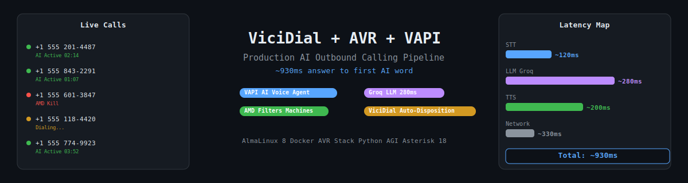
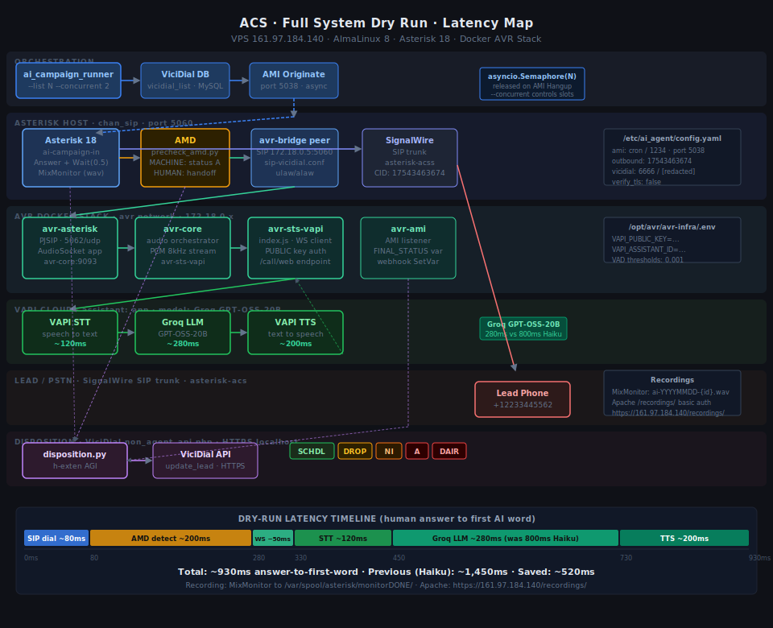
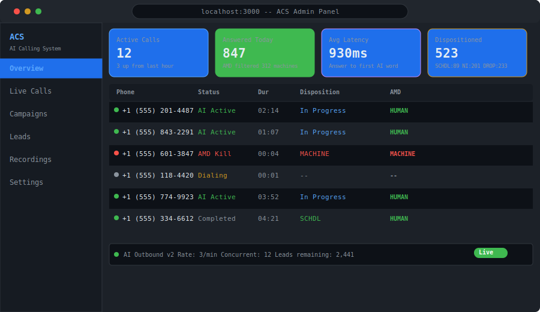
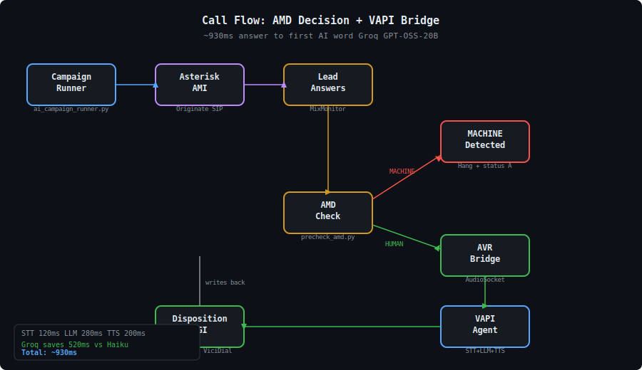

<div align="center">

# AI Calling System — ViciDial + AVR + VAPI

> **Production-ready outbound AI calling pipeline.**  
> Dials leads, detects humans vs machines, routes live calls to a real-time AI agent, and writes dispositions back to ViciDial automatically.  
> **~930 ms** from answer → first AI word spoken.

[](https://www.typescriptlang.org/)
[](https://python.org)
[](https://www.docker.com/)
[](https://vapi.ai)
[](https://vicidial.org)
[](https://github.com/staimoorulhassan/AI-Calling-Setup-VICIDAIL-VAPI-by-Taimoor-/releases/tag/v1.0.1)
[](https://github.com/staimoorulhassan/AI-Calling-Setup-VICIDAIL-VAPI-by-Taimoor-/commits)

**[🚀 Quick Deploy](#-quick-deploy) · [📐 Architecture](#-architecture) · [📞 Call Flow](#-call-flow) · [⚙️ Configuration](#️-configuration) · [📦 Release v1.0.1](https://github.com/staimoorulhassan/AI-Calling-Setup-VICIDAIL-VAPI-by-Taimoor-/releases/tag/v1.0.1)**



</div>

---

## What This Does

This repository is a complete **outbound AI calling system** deployed on a Contabo VPS running AlmaLinux 8. It replaces human SDRs for the first leg of outbound calls:

1. **AI Campaign Runner** pulls leads from ViciDial's MySQL database
2. **Asterisk AMI** originates SIP calls via SignalWire trunk
3. **AMD (Answering Machine Detection)** instantly kills calls that hit voicemail — no wasted minutes
4. **AVR Bridge** routes human-answered calls to VAPI's real-time AI voice agent
5. **Disposition AGI** writes outcomes (SCHDL / NI / DROP / A) back to ViciDial API automatically

**Latency achieved on live AlmaLinux 8 deployment:**

| Stage | Latency | Provider |
|---|---|---|
| STT (speech-to-text) | ~120 ms | VAPI built-in |
| LLM (language model) | ~280 ms | Groq GPT-OSS-20B |
| TTS (text-to-speech) | ~200 ms | VAPI built-in |
| **Total (answer → first AI word)** | **~930 ms** | — |

> Groq GPT-OSS-20B at ~280 ms vs ~800 ms with Claude Haiku — **520 ms saved per turn**.

---

## Architecture



<div align="center">

| Calls | Monitoring | Admin Panel |
|---|---|---|
|  |  |  |



> **These are design mockups.** See [docs/screenshots/SCREENSHOT-GUIDE.md](docs/screenshots/SCREENSHOT-GUIDE.md) to take real screenshots and record a GIF demo.

</div>

---

## Call Flow

```
ai_campaign_runner.py
  └─ picks leads from vicidial_list (MySQL)
  └─ AMI Originate → Asterisk [ai-campaign-in]
       └─ Answer + MixMonitor (local recording)
       └─ AGI: precheck_amd.py
            ├─ MACHINE / DAIR → disposition.py → status A/DAIR → Hangup
            └─ HUMAN          → Dial(SIP/avr-bridge/s)
                                    └─ avr-asterisk (PJSIP, port 5062)
                                         └─ AudioSocket → avr-core
                                              └─ WebSocket → avr-sts-vapi
                                                   └─ VAPI /call/web (PUBLIC key)
                                                        ├─ STT  ~120 ms
                                                        ├─ LLM  ~280 ms  (Groq GPT-OSS-20B)
                                                        └─ TTS  ~200 ms
       └─ h-exten: disposition.py → update_lead (SCHDL / NI / DROP / ...)
```

---

## Repository Layout

```
agi/
  precheck_amd.py          # AMD + handoff decision (MACHINE → hang up, HUMAN → AVR)
  disposition.py           # Writes lead status back to ViciDial API
  ai_campaign_runner.py    # Async campaign runner (panoramisk + pymysql)

dialplan/
  ai-campaign.conf         # [ai-campaign-in] Asterisk context — paste into your dialplan

config/
  config.yaml.example      # Copy to /etc/ai_agent/config.yaml and fill in

avr-infra/
  docker-compose-vapi.yml         # 4-container AVR stack (avr-core, avr-sts-vapi, avr-ami, avr-asterisk)
  extensions.container.conf       # avr-asterisk dialplan

production/
  host-asterisk/
    snippets.conf                 # avr-bridge SIP peer + ai-test-go context (host ViciDial Asterisk)

avr-app/
  backend/                        # NestJS 11 admin API (port 3001)
  frontend/                       # Next.js 16 admin panel (port 3000)

docs/
  acs-system-diagram.svg          # Full architecture + latency map
```

---

## Quick Deploy

### Prerequisites

| Component | Version | Purpose |
|---|---|---|
| AlmaLinux / CentOS | 8+ | ViciDial host OS |
| Asterisk | 18.x-vici | PBX with AMD, AudioSocket, AGI |
| ViciDial | 2.14-873a+ | Lead list + disposition API |
| Docker Engine | 24+ | AVR container stack |
| Python | 3.11 | AGI scripts + campaign runner |
| SignalWire | any | SIP trunk (`asterisk-acs`) |
| VAPI account | — | Public key + assistant ID |

### 1 — Clone

```bash
git clone https://github.com/staimoorulhassan/AI-Calling-Setup-VICIDAIL-VAPI-by-Taimoor-.git
cd AI-Calling-Setup-VICIDAIL-VAPI-by-Taimoor-
```

### 2 — AGI scripts on ViciDial host

```bash
cp agi/precheck_amd.py  /var/lib/asterisk/agi-bin/
cp agi/disposition.py   /var/lib/asterisk/agi-bin/
chmod +x /var/lib/asterisk/agi-bin/*.py
```

### 3 — Config

```bash
sudo mkdir -p /etc/ai_agent
sudo cp config/config.yaml.example /etc/ai_agent/config.yaml
# Fill in: vicidial DB creds, AMI creds, campaign ID, VAPI keys
sudo nano /etc/ai_agent/config.yaml
```

### 4 — Python dependencies

```bash
pip install -r agi/requirements.txt
# or: pip install panoramisk pymysql pyyaml aiohttp
```

### 5 — Dialplan

```bash
# Paste content of dialplan/ai-campaign.conf into your Asterisk extensions.conf
# Paste content of production/host-asterisk/snippets.conf into extensions.conf
asterisk -rx "dialplan reload"
```

### 6 — AVR Docker stack

```bash
cd avr-infra
cp .env.example .env
# Fill in: VAPI_PRIVATE_KEY, VAPI_PUBLIC_KEY, VAPI_ASSISTANT_ID, AMI_HOST, AMI_USERNAME, AMI_PASSWORD
nano .env
docker-compose -f docker-compose-vapi.yml up -d
```

### 7 — Launch campaign

```bash
python agi/ai_campaign_runner.py \
  --campaign-id 1 \
  --rate 3 \
  --concurrent 5 \
  --statuses NEW,CBHOLD
```

---

## Configuration Reference

### `/etc/ai_agent/config.yaml`

```yaml
vicidial:
  host: 127.0.0.1
  port: 3306
  user: cron
  password: <vicidial-db-password>
  database: asterisk

ami:
  host: 127.0.0.1
  port: 5038
  username: <ami-username>
  password: <ami-password>

outbound:
  caller_id: "+15551234567"
  trunk: "SIP/signalwire"
```

### `avr-infra/.env`

```env
VAPI_PRIVATE_KEY=<vapi-private-key>
VAPI_PUBLIC_KEY=<vapi-public-key>        # used for /call/web endpoint
VAPI_ASSISTANT_ID=<your-assistant-id>

AMI_HOST=<vicidial-host-ip>
AMI_PORT=5038
AMI_USERNAME=<ami-user>
AMI_PASSWORD=<ami-password>
```

> **VAPI_PRIVATE_KEY holds your PUBLIC key.** The `/call/web` endpoint requires the public key — this is intentional, not a typo.

---

## Admin Panel (avr-app)

The included `avr-app/` is a full NestJS + Next.js admin panel for managing agents, providers, campaigns, call recordings, and live call monitoring.

```bash
# Backend (port 3001)
cd avr-app/backend && npm install && npm run start:dev

# Frontend (port 3000)
cd avr-app/frontend && npm install && npm run dev
```

Default login: `admin@agentvoiceresponse.com` / `agentvoiceresponse`

---

## Key Fixes in v1.0.1

| Issue | Fix |
|---|---|
| VAPI key confusion | `VAPI_PRIVATE_KEY` holds the **public** key — required by `/call/web` endpoint |
| Audio not reaching VAPI | VAD thresholds loosened on `avr-core` |
| NAT RTP issues | `avr-bridge` peer: `rtp_symmetric=yes` + `force_rport,comedia` |
| Recording gap | MixMonitor added on outbound test path |

---

## Recordings

Calls are recorded by MixMonitor on the ViciDial Asterisk side and saved locally. The AVR bridge also optionally uploads recordings to S3 (`avr-app` recording module with `AWS_*` env vars).

---

## VPS File Map (Contabo `161.97.184.140`)

```
/var/lib/asterisk/agi-bin/
  precheck_amd.py
  disposition.py

/etc/ai_agent/
  config.yaml

/opt/avr/
  avr-infra/
    docker-compose-vapi.yml
    .env

/etc/asterisk/
  extensions.conf    ← dialplan/ai-campaign.conf content merged here
  pjsip.conf         ← avr-bridge PJSIP peer merged here
```

---

## Security

- **No secrets committed** — all API keys/DB passwords use `.env` + `.gitignore`
- **SignalWire trunk** — SIP credentials in Asterisk pjsip.conf only, not in version control
- **DNC compliance** — check your jurisdiction's regulations before deploying AI outbound calls
- **AMD required** — always enable AMD (`precheck_amd.py`) to avoid leaving AI on answering machines

---

## Contributing

1. Fork and clone
2. Create a branch: `git checkout -b feat/your-feature`
3. Test against a real ViciDial instance or the Docker test environment in `avr-infra/`
4. Open a Pull Request — include call log snippets showing before/after latency

---

## Release

**[v1.0.1 — Production VAPI Bridge](https://github.com/staimoorulhassan/AI-Calling-Setup-VICIDAIL-VAPI-by-Taimoor-/releases/tag/v1.0.1)**  
Working ViciDial + AVR + VAPI configuration from a live AlmaLinux 8 deployment. All secrets stripped — copy `.env.example` and fill in your values.

---

## License

No license is currently set on this repository. Standard copyright applies — contact the author for usage permission.

---

<div align="center">

Built and deployed by [staimoorulhassan](https://github.com/staimoorulhassan) on Contabo VPS · AlmaLinux 8.10

⭐ **Star this repo** if it helped you deploy an AI calling agent!

</div>
